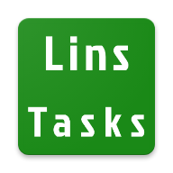
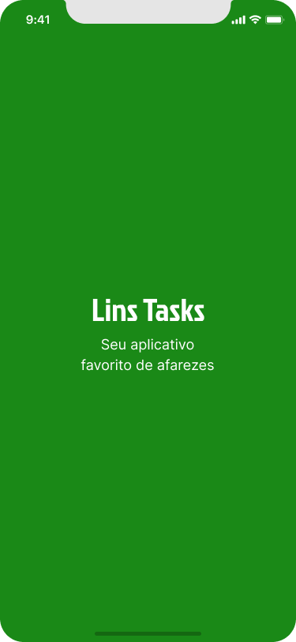
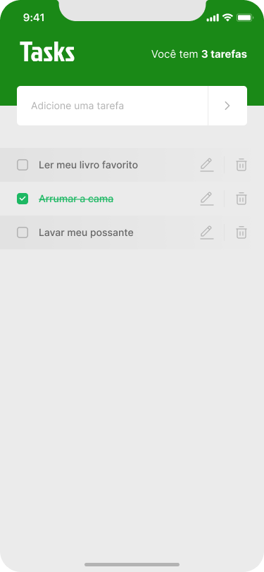
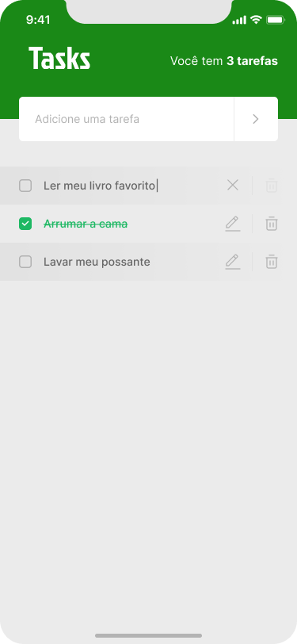

<h1 align="center">
  
  
Seu aplicativo favorito de afarezes

</h1>

<h2 align="center">Tabela de Conteúdos</h2>

 <a href="#sobre">Sobre</a> •
 <a href="#funcionalidades">Funcionalidades</a> •
 <a href="#layout">Layout</a> •
 <a href="#tecnologias">Tecnologias</a> • 
 <a href="#status">Status do Projeto</a> • 
 <a href="#autor">Autor</a>
 <a href="#licenca">Licença</a>

<h2 align="center" id="sobre">Sobre</h2>

Um App para controle de tarefas a fazer, com ele você vai poder criar, editar, excluir uma tarefa, também vai poder marcar ou descarcar uma tarefa como concluída, o App vai ter um contador monstrando quantas tarefas você tem registradas, seu objetivo é ajudar  o usuário a ter uma organização das tarefas diárias.

<h3 align="left" id="funcionalidades">Funcioalidades</h3>

- [x] Criar tarefas
- [x] Editar tarefas
- [x] Excluir tarefas
- [x] Marcar ou desmarcar tarefas como concluídas
- [x] Contabilizar tarefas cadastradas no App

<h2 align="left" id="layout">🎨 Layout</h2>

O layout da aplicação está disponível no Figma:

<h3 align="left" id="layout">Mobile</h3>

  
  

  
  

<h3 align="left" id="tecnologias">🛠 Tecnologias</h3>

As seguintes ferramentas foram usadas na construção do projeto

- [Node.js](https://nodejs.org/en/)
- [React](https://pt-br.reactjs.org/)
- [React Native](https://reactnative.dev/)
- [TypeScript](https://www.typescriptlang.org/)
- [Async Storage](https://react-native-async-storage.github.io/async-storage/docs/install)

<h2 align="left" id="status">Status do Projeto</h2>

 
	🚧  React Native 🚀 Versão 1.0 Concluída.  🚧.

<h2 align="left" id="autor">🦸 Autor</h2>

<a href="https://github.com/JailsonSantos">
 
  
 <b>Jailson Santos</b></a> <a href="https://www.linkedin.com/in/jailson-santos-726395104/" title="Jailson Santos">🚀</a>
  

 

<h2 align="left" id="licenca">📝 Licença</h2>

Este projeto esta sobe a licença [MIT](./LICENSE).

Feito com ❤️ por Jailson Santos 👋🏽 [Entre em contato!](https://www.linkedin.com/in/jailson-santos-726395104/)
